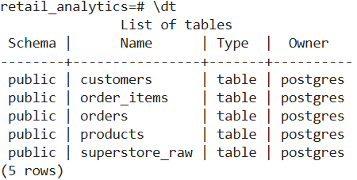
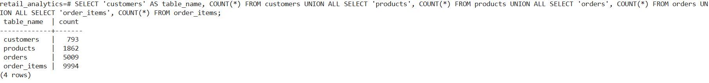
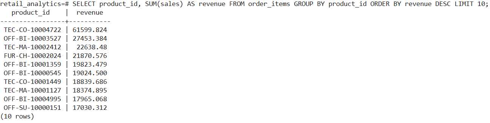
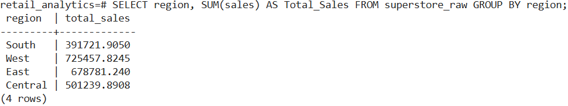
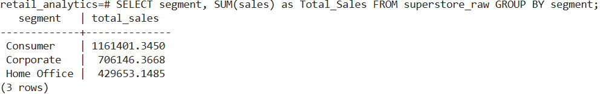
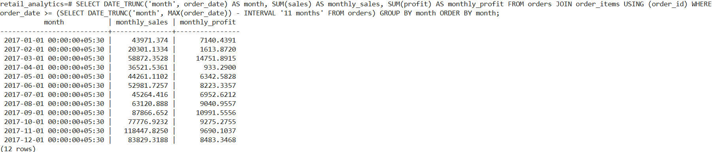
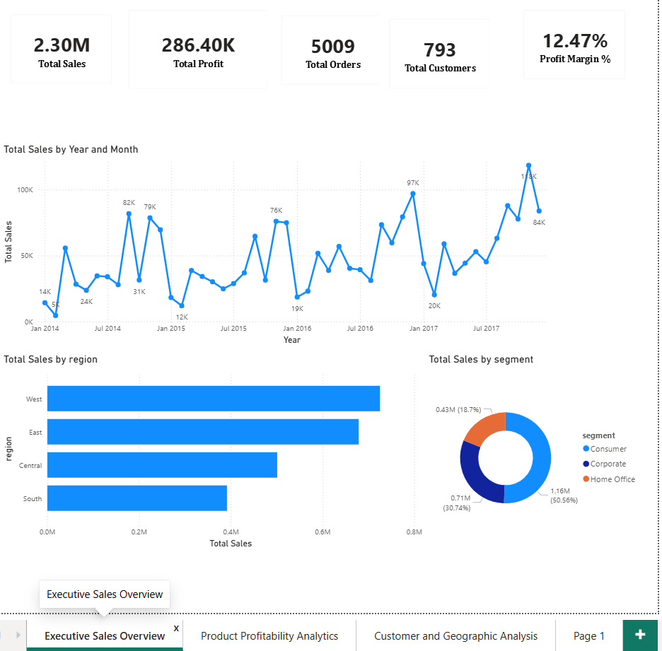
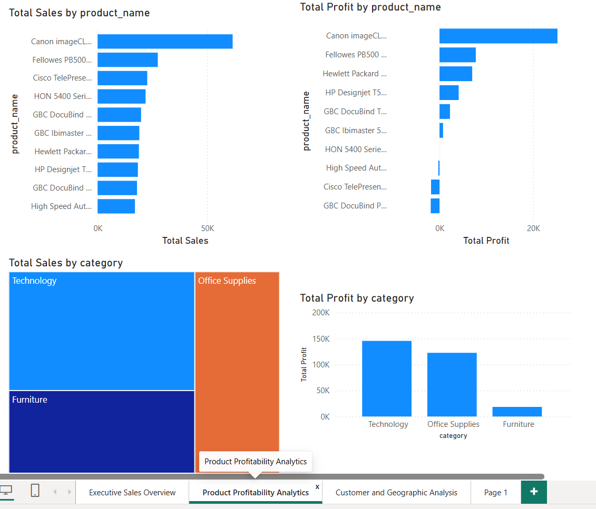
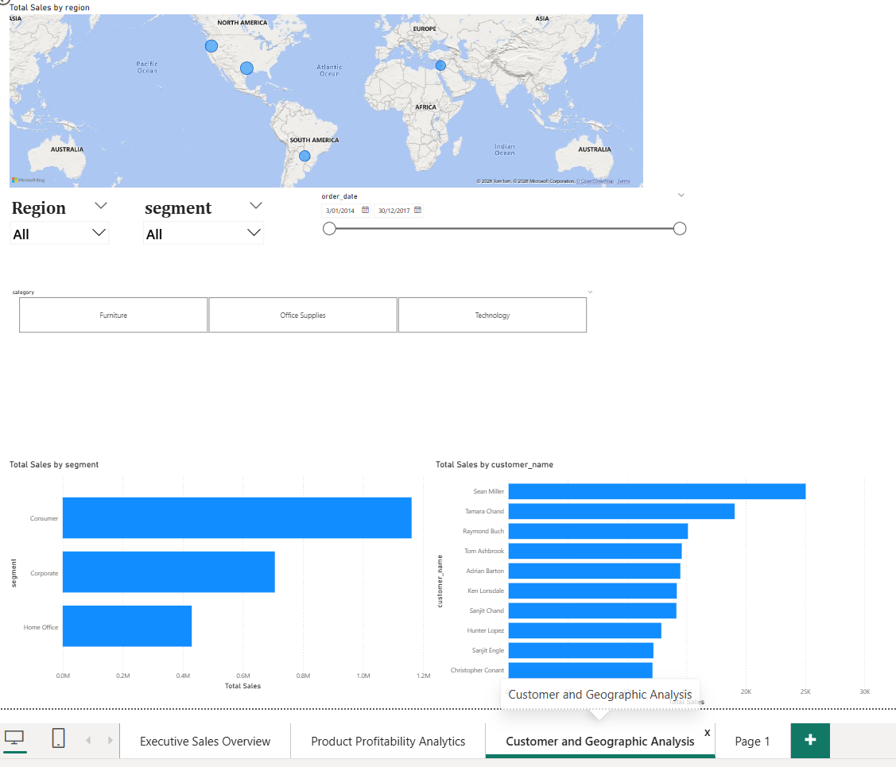
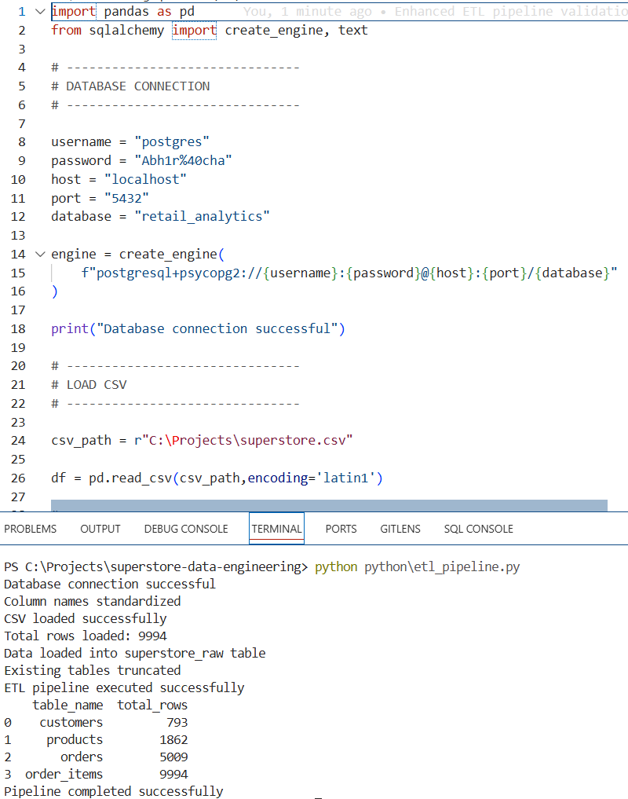

# Superstore Data Engineering Project

## Overview

Built an end-to-end PostgreSQL ETL pipeline using the Superstore dataset.

Pipeline Flow:

CSV → Raw Staging → ETL → Fact & Dimension Tables → Analytics

---

## Tech Stack

- PostgreSQL
- SQL
- Git
- GitHub
- VS Code

---

## Dataset

Superstore Dataset from Kaggle.

---

## Project Structure

```text
superstore-data-engineering/
│
├── data/
├── sql/
├── dashboard/
├── python/
├── screenshots/
├── README.md
└── .gitignore
```

---

## Data Model

### Dimension Tables
- customers
- products
- orders

### Fact Table
- order_items

---

## Skills Demonstrated

- ETL pipeline design
- Data normalization
- Staging tables
- SQL analytics
- Data warehouse modeling

---

## Sample Analytics

- Total Revenue Analysis
- Top Revenue Generating Products
- Regional Sales Performance Analysis
- Customer Segment Profitability Analysis
- Monthly Revenue Trend Analysis
---
## Tables Created


## ETL Verfication Query


## Top Revenue Generating Products


## Regional Sales Performance Analysis


## Customer Segment Profitability Analysis


## Monthly Revenue Trend Analysis


## Power BI Dashboard

## Executive Sales Performance Overview


## Product Revenue & Profitability Analysis


## Customer & Regional Intelligence Overview


Power BI Features:
- Interactive KPI cards
- Monthly revenue trend analysis
- Regional sales analysis
- Product profitability analysis
- Customer intelligence reporting
- Synchronized slicers
- Interactive dashboard filtering

Dashboard Technologies:
- Power BI Desktop
- PostgreSQL
- DAX Measures
- Star Schema Data Model

## Advanced SQL Analytics

Implemented advanced PostgreSQL window functions including:

- RANK()
- DENSE_RANK()
- SUM() OVER()
- PARTITION BY
- LAG()
- LEAD()
- NTILE()

Advanced analytics performed:

- Product profitability ranking
- Running revenue analysis
- Regional sales benchmarking
- Month-over-month sales comparison
- Predictive revenue trend analysis
- Customer revenue segmentation

## Python ETL Enhancements

- Automated ETL pipeline using Python
- PostgreSQL warehouse loading
- Schema standardization
- Incremental data loading
- ETL validation reporting

## Python ETL Pipeline Validation


## Future Improvements

- Cloud database deployment
- Real-time dashboard integration
- Automated reporting pipeline